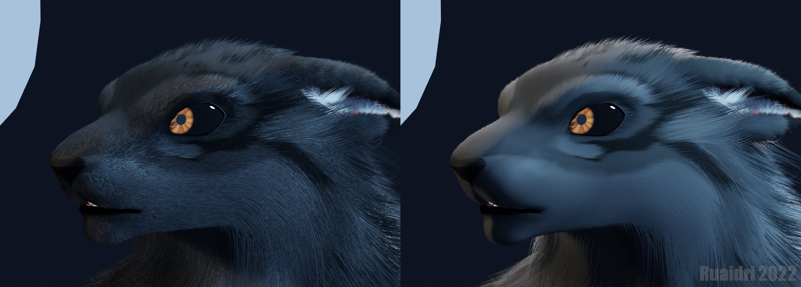
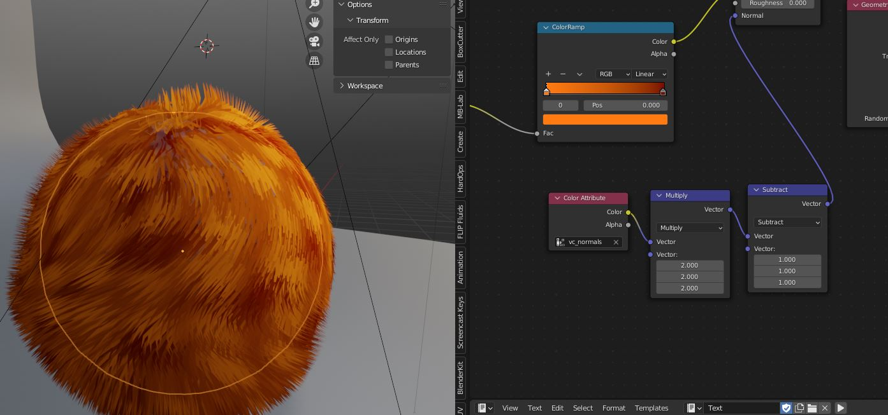
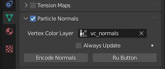

# encode-normals
## A Blender addon to copy mesh normals to hair via vertex colors

_As seen on TV!_

*image courtesy of [ruaidri @ furaffinity](https://furaffinity.net/user/ruaidri)*

encode-normals is a small blender addon that copies the normals of a particle
emitter to the particle strands each frame, for use in stylized fur shaders.

Blender does not provide access to the underlying emitter normals in the same
way it does for mesh color. To get around this, the encode-normals addon stores
emitter normals in world space in a vertex color layer. When enabled, it will 
automatically update the vertex color layer each frame for rendering. 

## Donationware
I'm releasing this addon for free, no strings attached. It's open source under
GPL2, just like Blender. 

But if you like it and you use it a lot, please consider buying me a coffee at
my [Ko-Fi account](https://ko-fi.com/sentharn)!

You _do not_ need to credit me if you use this addon. But I'd love to see
what you make! Feel free to send me a link so I can admire it.

## Credits
This addon was heavily inspired by and partially based on Steve Miller's
[Mesh Tension Addon](https://blenderartists.org/t/revised-mesh-tension-add-on/1239091)

## Encoding 
Vertex colors are stored as RGB values from [0, 1]. Normals are stored as
[-1, 1]. The plugin will map store the normals as 
`(normal * 0.5) + Vector3(0.5, 0.5, 0.5)`.

To reverse this transformation, you need to multiply the values by `2`
and then subtract `0.5` by using Vector Math nodes in the shader editor

## Installation

1. Download the extension .py file
2. In Blender, go to Preferences -> Add-Ons
3. Click Install and select the .py file
4. Enable `Mesh > Encode Normals` via the checkbox

## How to use

1. Enable the `Render -> Lock Render` checkbox. This avoids crashes during viewport updates, but your viewport will not respond while rendering (ESC still works)
2. Click on a mesh that you want to enable this feature on
3. Under Mesh properties, enable `Particles Normals` via the checkbox. This will create the vc_normals vertex color group if it does not exist yet.
4. Set up the shader using the node group above to use your encoded normals instead of generated normals.
5. Click `Encode Normals` to manually encode normals for the current frame while doing viewport work.
6. The addon will automatically encode normals every frame for you during render
7. Click the `Ru Button`, which literally does nothing but looks cool

## Bonus Features

* Ru Button (does nothing)

## Limitations
It does _not_ currently update per frame within the viewport, to avoid slowing
down the viewport for animation work. A button is available to manually update 
the vertex color layer.

## Known Issues

* The plugin will throw an error if you click Encode Normals before clicking the checkbox. I forgot to make the addon disable itself until the checkbox is clicked. Lol.